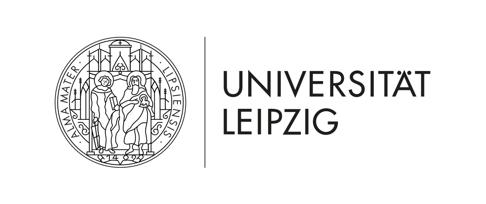

# **THE ROLE OF WORK IN THE DEVELOPMENT OF CIVILIZATION DISEASES**

Reducing premature mortality due to civilization diseases by one third until 2030 through prevention and treatment is one of the United Nation's Sustainable Development Goals. The reorientation of the professorship contributes to efforts that address this societal "grand challenge" by examining the joint effects of work design and individuals' work-related actions on the development of civilization diseases using a transdisciplinary and multifaceted approach that integrates research, teaching, and community engagement activities. So far, work and organizational psychologists have shied away from investigating the role of work with regard to the prevention, onset, and development of noncommunicable and chronic civilization diseases.  
  
The motivation for the perspective extension stems from three central reasons. First, psychological theories and methods are currently underutilized with regard to understanding the "grand challenge" of civilization diseases. Second, addressing this challenge and, thus, having an impact on public health requires innovative teaching methods and career guidance for students as well as enhanced science communication with practitioners and the public. Third, this program offers the opportunity to integrate the chair with the existing research strengths and core research areas in Leipzig.  
&nbsp;  
&nbsp;  

## **Work and Health in the Time of COVID-19: A Longitudinal Study**  

A longitudinal study was started in December 2019 to  investigate, using monthly data collections from a large national sample in Germany, how work characteristics and employee behavior relate to physical and mental health. In the continuation of the study the results could show how changes in work arrangements due to the COVID-19 pandemic influence health over time and how people can effectively cope with this crisis, potentially even enabling personal
growth. The findings will have significant practical implications for the design and implementation of interventions to improve the health and wellbeing of employees, and they can help organizations prepare for future crises.  
On the following pages we present some exemplary results, summarized under various topics. As time goes on, more and more pages will be added to this website.
&nbsp;  
&nbsp;  

### In Cooperation with:
<h4> [Volkswagen Foundation](https://www.volkswagenstiftung.de/) </h4>  
&nbsp;
<h4> [Department of Work and Organizational Psychology, Leipzig University](https://www.lw.uni-leipzig.de/aopsych)  </h4>  
&nbsp;
<h4> [Department of Psychology, Saint Louis University](https://www.slu.edu/arts-and-sciences/psychology/) </h4>   
&nbsp;

&nbsp;  
&nbsp;  
&nbsp;  

